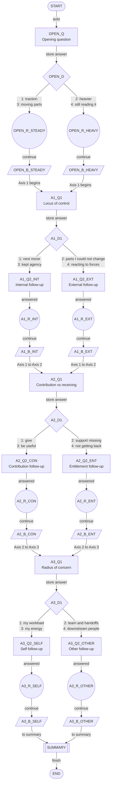

[tree-diagram.md](https://github.com/user-attachments/files/27019550/tree-diagram.md)

```mermaid
graph TD
  START([START]) -->|"auto"| OPEN_Q["OPEN_Q<br/>Opening question"]
  OPEN_Q -->|"store answer"| OPEN_D{"OPEN_D"}
  OPEN_D -->|"1: traction<br/>3: moving parts"| OPEN_R_STEADY(("OPEN_R_STEADY"))
  OPEN_D -->|"2: heavier<br/>4: still reading it"| OPEN_R_HEAVY(("OPEN_R_HEAVY"))
  OPEN_R_STEADY -->|"continue"| OPEN_B_STEADY[/OPEN_B_STEADY/]
  OPEN_R_HEAVY -->|"continue"| OPEN_B_HEAVY[/OPEN_B_HEAVY/]
  OPEN_B_STEADY -->|"Axis 1 begins"| A1_Q1["A1_Q1<br/>Locus of control"]
  OPEN_B_HEAVY -->|"Axis 1 begins"| A1_Q1

  A1_Q1 -->|"store answer"| A1_D1{"A1_D1"}
  A1_D1 -->|"1: next move<br/>3: kept agency"| A1_Q2_INT["A1_Q2_INT<br/>Internal follow-up"]
  A1_D1 -->|"2: parts I could not change<br/>4: reacting to forces"| A1_Q2_EXT["A1_Q2_EXT<br/>External follow-up"]
  A1_Q2_INT -->|"answered"| A1_R_INT(("A1_R_INT"))
  A1_Q2_EXT -->|"answered"| A1_R_EXT(("A1_R_EXT"))
  A1_R_INT -->|"continue"| A1_B_INT[/A1_B_INT/]
  A1_R_EXT -->|"continue"| A1_B_EXT[/A1_B_EXT/]
  A1_B_INT -->|"Axis 1 to Axis 2"| A2_Q1["A2_Q1<br/>Contribution vs receiving"]
  A1_B_EXT -->|"Axis 1 to Axis 2"| A2_Q1

  A2_Q1 -->|"store answer"| A2_D1{"A2_D1"}
  A2_D1 -->|"1: give<br/>3: be useful"| A2_Q2_CON["A2_Q2_CON<br/>Contribution follow-up"]
  A2_D1 -->|"2: support missing<br/>4: not getting back"| A2_Q2_ENT["A2_Q2_ENT<br/>Entitlement follow-up"]
  A2_Q2_CON -->|"answered"| A2_R_CON(("A2_R_CON"))
  A2_Q2_ENT -->|"answered"| A2_R_ENT(("A2_R_ENT"))
  A2_R_CON -->|"continue"| A2_B_CON[/A2_B_CON/]
  A2_R_ENT -->|"continue"| A2_B_ENT[/A2_B_ENT/]
  A2_B_CON -->|"Axis 2 to Axis 3"| A3_Q1["A3_Q1<br/>Radius of concern"]
  A2_B_ENT -->|"Axis 2 to Axis 3"| A3_Q1

  A3_Q1 -->|"store answer"| A3_D1{"A3_D1"}
  A3_D1 -->|"1: my workload<br/>3: my energy"| A3_Q2_SELF["A3_Q2_SELF<br/>Self follow-up"]
  A3_D1 -->|"2: team and handoffs<br/>4: downstream people"| A3_Q2_OTHER["A3_Q2_OTHER<br/>Other follow-up"]
  A3_Q2_SELF -->|"answered"| A3_R_SELF(("A3_R_SELF"))
  A3_Q2_OTHER -->|"answered"| A3_R_OTHER(("A3_R_OTHER"))
  A3_R_SELF -->|"continue"| A3_B_SELF[/A3_B_SELF/]
  A3_R_OTHER -->|"continue"| A3_B_OTHER[/A3_B_OTHER/]
  A3_B_SELF -->|"to summary"| SUMMARY[[SUMMARY]]
  A3_B_OTHER -->|"to summary"| SUMMARY
  SUMMARY -->|"finish"| END([END])
```
